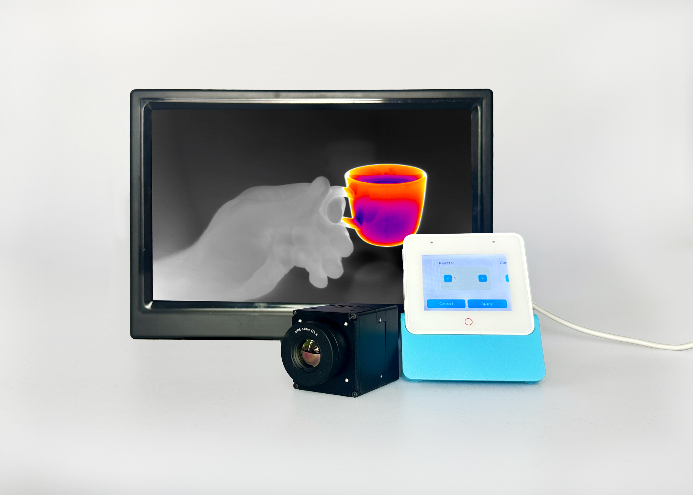

# WEOMlink



WEOMlink is a lightweight C++ library designed to manage [WEOM cameras](https://workswell.eu/weom-hdmi-thermal-core-advanced-thermal-imaging/) on embedded platforms over UART interface. It leverages C++20 features and the [ETL (Embedded Template Library)](https://www.etlcpp.com/) to optimize performance in resource-constrained environments as well as full fledged desktop applications. The library can access the following thermal core features

* read device information such as serial number, firmware version, etc...
* change predefined display palette
* change contrast and brightness
* change frame rate
* change both horizontal and vertical image flip
* image freezing
* image source between sensor and predefined test patterns
* time domain average
* image equalization
* ADC NH smoothing
* toggle spatial median filter
* change gain
* change optical lense specification

We provide ready to run examples for Espressif Kaluga a Box-3 dev kits but the library is designed to work efficiently on just about any device. You can purchase complete WEOM development kits directly from Workswell. There we provide connector boards/adapters for both the Box-3 and Kaluga as the

## Installation

Clone this repository into Your CMake project folder (or add it as submodule)

```sh
git clone https://github.com/Workswell-s-r-o/WEOMlink.git
```

or

```sh
git submodule add https://github.com/Workswell-s-r-o/WEOMlink.git
```

next add WEOMlink as subdirectory into `CMakeLists.txt`

```cmake
add_subdirectory(weom-link)
```

Link WEOMlink to Your Cmake target:

```cmake
target_link_libraries(<your_target> PUBLIC WEOM::link)
```

To build the library only (make sure you are in the WEOMlink directory):

```bash
cmake --build . --target weomlink
```

To build Doxygen API docs only:

```bash
cmake --build . --target weomlink_docs
```

To build the library without pulling in ETL with `FetchContent` (if you're already sourcing ETL in a different way):
```bash
cmake -B build -DWEOMLINK_BUILD_ETL=OFF
```

The generated API documentation is generated into `html`directory.

## Usage

To use WEOMlink on your platform of choice you must implement the `wl::IDataLinkInterface` class to define data transfer methods

```cpp
#include "wl/communication/idatalinkitnerface.h"


class MyDataLinkInterface : public wl::IDataLinkInterface
{
public:
    virtual bool isOpened() const override;

    virtual void closeConnection() override;

    virtual size_t getMaxDataSize() const override;

    virtual etl::expected<void, wl::Error> read(etl::span<uint8_t> buffer, const wl::Clock::duration& timeout) override;

    virtual etl::expected<void, wl::Error> write(etl::span<const uint8_t> buffer, const wl::Clock::duration& timeout) override;

    virtual void dropPendingData() override;

    virtual bool isConnectionLost() const override;
};
```

After implementing the data link interface, initialize an instance of `wl::WEOM` and set the data link interface using setDataLinkInterface.

```cpp
#include "wl/weom.h"

void sleepFunction(const wl::Clock::duration& duration)
{
    // implement sleep function for your plaftorm
    // std::this_thread::sleep_for(duration);
    vTaskDelay(pdMS_TO_TICKS(std::chrono::duration_cast<std::chrono::milliseconds>(duration).count()));
}

int main(int argc, char** argv)
{
    wl::WEOM camera(sleepFunction);

    auto dataLink = etl::unique_ptr<MyDataLinkInterface>(new MyDataLinkInterface);

    camera.setDataLinkInterface(etl::move(dataLink));

    // ...
}
```

With the camera interface set, you can now use various functions, such as retrieving the camera's serial number. Below is an example of fetching and handling the serial number.

```cpp
auto serialNumber = camera.getSerialNumber();
if (!serialNumber.has_value())
{
    std::cerr << "Failed to get serial number. Error: " << serialNumber.error().c_str() << std::endl;
}
std::cout << "Serial number: " << serialNumber.value().c_str() << std::endl;
```

## Examples

We provide two ready to run example projects for widely used ESP32 dev kits, the Kaluga a Box-3. The examples can be found in `examples`subdirectory and need to be built separately. The library will be built and linked during the example build process as well, it does not need to be built separately. The examples use [esp-bsp](https://github.com/espressif/esp-bsp) HAL and we have pinned the [ESP-IDF](https://) to version `5.1.5` and `esp-box-3`to`1.2.0~2` to resolve various dependency issues.

Provided that you have setup your ESP-IDF environment correctly, to build the example simply run the following commands from the project directory:

```bash
idf.py build
```

and finally to flash the device:

```bash
idf.py --port <device> flash
```
